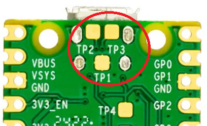

# 🎮 Raspberry Pi Pico Arcade Stick PCB  

This repository contains the design files for a custom **Raspberry Pi Pico breakout PCB**, specifically designed for arcade sticks. The board simplifies wiring and connections by breaking out the Pico’s GPIO pins while using standardized elements like **screw terminals** and a **20-pin connector**, making it easy to integrate into arcade controller builds.  

## 📌 General Info  
🔹 **Based on [GP2040-CE](https://github.com/OpenStickCommunity/GP2040-CE)**  
🔹 **Common Brook form factor**  
🔹 **Breaks out all Pins for the most common uses:**  
   - 🎮 **Punch Buttons** 1-4  
   - 🎮 **Kick Buttons** 1-4  
   - 🎮 **Directional Inputs** (Up, Down, Left, Right)  
   - 🎮 **Start & Select**  
   - 🎮 **Buttons for modern console support:** Home, Touchpad, L3, R3  
   - 🎮 **Switchable Input Modes:** D-Pad, Left-Stick, Right-Stick  
   - 🌈 **Support for Addressable RGB LEDs**  
   - 🔌 **USB-Passthrough Authentication Support** – [FAQ: Console Compatibility](https://gp2040-ce.info/faq/faq-console-compatibility/)  
   - 📟 **Pins for OLED Display**  

🔹 **Compatible for both Leverless and Traditional Arcade Stick builds**  

## Assembly  
The PCB can be fully hand soldered, but soldering the SMD components might be easier by using a hotplate. To make use of the USB Type B Jack Port and the external USB pins, the testpads on the back of the Rasperry Pi Pico have to be soldered.

## Components  
- **Raspberry Pi Pico (Version 1)**  [image](images/pico.jpg) [component location](images/component%20locations/obPico.png)
- **3x6x2.5MM Momentary Tact SMD** (Amount: 1)  [component location](images/component%20locations/obButton.png)
- **USB Type B Jack Port** (Amount: 1) *(This can be omitted. The USB-Connector of the Pico can be used directly instead)* [component location](images/component%20locations/obUSB-B.png) 
- **USB Type A Port** *(Used for USB-Passthrough dongles)*  [component location](images/component%20locations/obUSB-A.png)
- **22Ohm resistors, package type 0603** (Amount: 2)  [component location](images/component%20locations/ob22.png)
- **4.7K Ohm resistors, package type 1206** (Amount: 2)  [component location](images/component%20locations/ob47k.png)
- **MF-PSMF050X-2 SMD Fuse, package type 0805** (Amount: 1) – [More](https://www.mouser.de/ProductDetail/Bourns/MF-PSMF050X-2?qs=89sKJMJLNwxOThYF3e0Dgg%3D%3D)  [component location](images/component%20locations/obFuse.png)
- **KF350 3.5mm pitch 3Pin screwterminal** (Amount: 7)  [component location](images/component%20locations/obScrew3.png)
- **KF350 3.5mm pitch 2Pin screwterminal** (Amount: 1)  [component location](images/component%20locations/obScrew2.png)
- **JST PH 2.0mm 2pin straight male header** (Amount: 3)  [component location](images/component%20locations/obPH2.png)
- **JST PH 2.0mm 3pin straight male header** (Amount: 1)  [component location](images/component%20locations/obPH3.png)
- **JST PH 2.0mm 4pin straight male header** (Amount: 3)  [component location](images/component%20locations/obPH4.png)
- **JST XH 2.54mm 3pin straight male header** (Amount: 1)  [component location](images/component%20locations/obXH3.png)
- **2x10 2.54mm pitch straight male header** (Amount: 1)  [component location](images/component%20locations/ob20.png)
- **1x5 2.54mm pitch straight male header** (Amount: 2)    [component location](images/component%20locations/ob5p.png)

## PCB
The PCB was created with EasyEDA and the design file for it, as well as premade gerber files are included in 📁 PCB Design Files

## Firmware
Fully configured and compiled firmware can be found in 📁 firmware.
To flash new firmware, hold the "Bootsel" button on the Pico and plug it into a PC. First reset the device to factory setting by drag & dropping the "flash_nuke.uf2" into the directory that opens. Afterwards drag & drop a firmware file, (e.g GP2040-CE_0.7.10_PicoToArcade.uf2) into the directory that opens.

## Credits
This design is a refined and customized version of the pico-advanced-breakout-board by [TheTrain](https://github.com/TheTrainGoes). A huge thanks to him for his work in creating and sharing the original design and the GP2040-CE community for creating the fantastic software.

